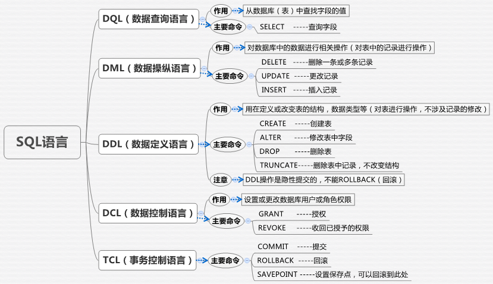

== SQL中DQL，DML，DDL，DCL，TCL的区别

=== 数据查询语言DQL(Data Query Language)

- 作用：查询表中的字段
- 命令：select

.DQL语法：
[source,sql]
----
SELECT      select_list
[ INTO      new_table ]
FROM        table_source
[ WHERE     search_condition ]
[ GROUPBY   group_by_expression ]
[ HAVING    search_condition ]
[ ORDERBY   order_expression [ ASC | DESC ] ]
----

=== 数据操纵语言DML(data manipulation language)

- 作用：对数据库的数据进行相关操作(对表中的记录进行操作)
- 命令： delete、update、insert

.DML语法
[source,sql]
----
-- delete 语法：删除表中一条或多条记录
DELETE FROM 表名 WHERE 列名 = 值;

-- update 语法：更改表中记录
UPDATE 表名 SET 列名 = 新值 WHERE 列名称 = 某值;

-- insert 语法：向表中添加记录
INSERT INTO 表名(列1，列2) VALUES (值1，值1);
----

=== 数据定义语言DDL(data definition language)

- 作用：在定义或改变表(TABLE)的结构，数据类型，表之间的链接和约束等初始化工作上，他们大多在建立表时使用 (对表进行操作，不涉及记录)
- 命令：create 、alter 、drop 、truncate

[source,sql]
----
-- create 语法：创建表
CREATE table 表名;

-- alter 语法：修改表中字段(增加列，更改列，删除列)
ALTER table 表名 ADD      (test_id number)  -- 增加列
ALTER table 表名 MODIFY   (test_id number)  -- 更改列
ALTER table 表名 DELETE   (test_id )        -- 删除列

-- drop 语法：删除表(删除表结构和记录)
DROP table 表名

-- truncate 语法：删除表(删除记录，保留表结构)
TRUNCATE table 表名
----

=== 数据控制语言DCL(Data Control Language)

- 作用： 数据控制语言DCL用来设置或更改数据库用户或角色权限
- 命令：
. grant 授权
. revoke 收回已经授予的权限

注意： 在默认状态下，只有sysadmin,dbcreator,db_owner或db_securityadmin等人员才有权力执行DCL

=== 事务控制语言TCL(Transaction Control Language)

- 命令：
. COMMIT 提交
. ROLLBACK 回滚
. SAVEPOINT 在事务中设置保存点，可以回滚到此处
. SET TRANSACTION 改变事务选项
