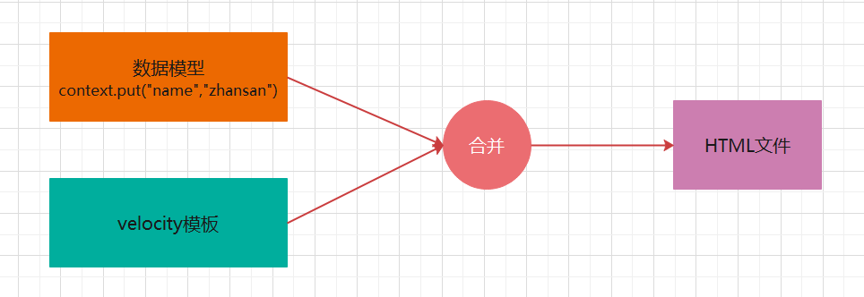
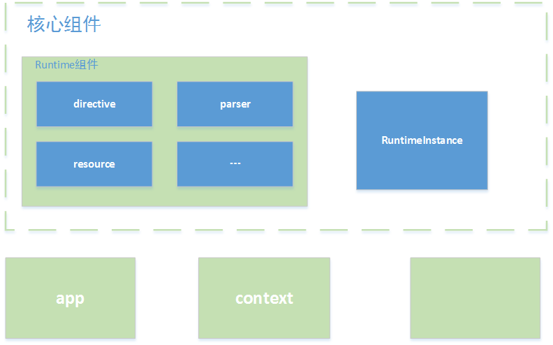

# 一. velocity简介

## 1. velocity简介

Velocity是一个基于Java的模板引擎，可以通过特定的语法获取在java对象的数据 , 填充到模板中，从而实现界面和java代码的分离 !



## 2. 应用场景

- Web应用程序 : 作为为应用程序的视图, 展示数据。
- 源代码生成  : Velocity可用于基于模板生成Java源代码
- 自动电子邮件 : 网站注册 , 认证等的电子邮件模板
- 网页静态化  : 基于velocity模板 , 生成静态网页

## 3. velocity 组成结构



Velocity主要分为app、context、runtime和一些辅助util几个部分。

- app模块 : 主要封装了一些接口 , 暴露给使用者使用。主要有两个类，分别是Velocity(单例)和VelocityEngine。

- Context模块 : 主要封装了模板渲染需要的变量

- Runtime模块 : 整个Velocity的核心模块，Runtime模块会将加载的模板解析成语法树，Velocity调用mergeTemplate方法时会渲染整棵树，并输出最终的渲染结果。

- RuntimeInstance类为整个Velocity渲染提供了一个单例模式，拿到了这个实例就可以完成渲染过程了。

# 二. 快速入门

## 1. 需求分析

使用velocity定义html模板 , 将动态数据填充到模板中 , 形成一个完整的html页面

## 2. 步骤分析

1. 创建项目(maven)
2. 引入依赖
3. 定义模板
4. 输出html

## 3. 代码实现

### 3.1 创建工程


### 3.2 引入坐标

```xml
<dependencies>
    <dependency>
        <groupId>org.apache.velocity</groupId>
        <artifactId>velocity-engine-core</artifactId>
        <version>2.2</version>
    </dependency>
    <dependency>
        <groupId>junit</groupId>
        <artifactId>junit</artifactId>
        <version>4.12</version>
        <scope>test</scope>
    </dependency>
</dependencies>
```

### 3.3 编写模板

在项目`resources`目录下创建模板文件

```html
<!DOCTYPE html>
<html lang="en">
<head>
    <meta charset="UTF-8">
    <title>Title</title>
</head>
<body>

hello , ${name} !

</body>
</html>
```

### 3.4 输出结果

```java
@Test
public void test1() throws IOException {
    //设置velocity资源加载器
    Properties prop = new Properties();
    prop.put("file.resource.loader.class", "org.apache.velocity.runtime.resource.loader.ClasspathResourceLoader");
    Velocity.init(prop);

    //创建Velocity容器
    VelocityContext context = new VelocityContext();
    context.put("name", "zhangsan");
    //加载模板
    Template tpl = Velocity.getTemplate("vms/demo1.vm", "UTF-8");

    FileWriter fw  = new FileWriter("D:\\work\\workspace\\velocity\\velocity_01\\src\\main\\resources\\html\\demo1.html");
    //合并数据到模板
    tpl.merge(context, fw);

    //释放资源
    fw.close();
}
```

## 4. 运行原理

Velocity解决了如何在后台程序和网页之间传递数据的问题，后台代码和视图之间相互独立，一方的修改不影响另一方 .

他们之间是通过环境变量（Context）来实现的，网页制作一方和后台程序一方相互约定好对所传递变量的命名约定，比如上个程序例子中的site,
name变量，它们在网页上就是$name ,$site 。

只要双方约定好了变量名字，那么双方就可以独立工作了。无论页面如何变化，只要变量名不变，那么后台程序就无需改动，前台网页也可以任意由网页制作人员修改。这就是Velocity的工作原理。


# 三. 基础语法

## 3.1 VTL介绍

Velocity Template Language (VTL) , 是Velocity 中提供的一种模版语言 , 旨在提供最简单和最干净的方法来将动态内容合并到网页中。简单来说VTL可以将程序中的动态数展示到网页中

VTL的语句分为4大类：**注释** , **非解析内容 ** , **引用**和**指令**。

## 3.2 VTL注释

### 3.2.1 语法

**1. 行注释**

```
## 行注释内容
```

**2. 块注释**

```
#*
块注释内容1
块注释内容2
*#
```

**3. 文档注释**

```
#**
文档注释内容1
文档注释内容2
*#
```

### 3.2.1 示例

```html
<!DOCTYPE html>
<html lang="en">
<head>
    <meta charset="UTF-8">
    <title>Title</title>
</head>
<body>
## 我是行注释

#*
* 我是块注释
* 呵呵呵
* *#

#**
* 我是文档注释
*
* *#
hello , ${name} !

</body>
</html>
```

## 3.3 非解析内容

所谓非解析内容也就是不会被引擎解析的内容。

### 3.3.1 语法

```
#[[
非解析内容1
非解析内容2 
]]#
```

### 3.3.2 示例

```html
<!DOCTYPE html>
<html lang="en">
<head>
    <meta charset="UTF-8">
    <title>Title</title>
</head>
<body>

hello , ${name} !
    
<h1>非解析内容</h1>
#[[
直接输出的内容1
直接输出的内容2
${name}
]]#
</body>
</html>
```

## 3.4 引用

### **3.4.1 变量引用**

引用语句就是对引擎上下文对象中的属性进行操作。语法方面分为常规语法(`$属性`)和正规语法(${属性})。

#### 语法

```
$变量名, 若上下文中没有对应的变量，则输出字符串"$变量名"
${变量名},若上下文中没有对应的变量，则输出字符串"${变量名}" 
$!变量名, 若上下文中没有对应的变量，则输出空字符串"" 
$!{变量名}, 若上下文中没有对应的变量，则输出空字符串""
```

#### 示例

```html
<!DOCTYPE html>
<html lang="en">
<head>
    <meta charset="UTF-8">
    <title>Title</title>
</head>
<body>
<h1>引用变量</h1>
常规语法 : $name
正规语法 : ${name}

## 如果获取的变量不存在, 表达式会原样展示 , 如果不想展示 , 可以使用 $!变量名
## 以下写法的含义代表么如果有变量, 那么获取变量值展示, 没有变量展示""
常规语法 : $!name
正规语法 : $!{name}

</body>
</html>
```

### 3.4.2 属性引用

#### 语法

```
$变量名.属性, 	若上下文中没有对应的变量，则输出字符串"$变量名.属性"
${变量名.属性}	若上下文中没有对应的变量，则输出字符串"${变量名.属性}"
$!变量名.属性	若上下文中没有对应的变量，则输出字符串""
$!{变量名.属性}	若上下文中没有对应的变量，则输出字符串""
```

#### 示例

```html
<!DOCTYPE html>
<html lang="en">
<head>
    <meta charset="UTF-8">
    <title>Title</title>
</head>
<body>
<h1>引用属性</h1>
常规语法 : $user.username --- $user.password
正规语法 : ${user.username} --- ${user.password}

正规语法 : ${user.email} --- ${user.email}
正规语法 : $!{user.email} --- $!{user.email}

</body>
</html>
```

### 3.4.3 方法引用

方法引用实际就是指方法调用操作，关注点**返回值**和**参数** , 方法的返回值将输出到最终结果中

#### 语法

```
$变量名.方法([入参1[, 入参2]*]?), 常规写法
${变量名.方法([入参1[, 入参2]*]?)}, 正规写法

$!变量名.方法([入参1[, 入参2]*]?), 常规写法
$!{变量名.方法([入参1[, 入参2]*]?)}, 正规写法
```

#### 示例

```html
<!DOCTYPE html>
<html lang="en">
<head>
    <meta charset="UTF-8">
    <title>Title</title>
</head>
<body>
<h1>引用属性</h1>
$str.split(" ")
${str.split(" ")}
$time.getTime()
${time.getTime()}

</body>
</html>
```

## 3.5 指令

指令主要用于定义重用模块、引入外部资源、流程控制。指令以 `#` 作为起始字符。

### 3.5.1 流程控制

#### #set

**作用 :** 在页面中声明定义变量

**语法：** `#set($变量 = 值)`

**示例 :**

```html
<!DOCTYPE html>
<html lang="en">
<head>
    <meta charset="UTF-8">
    <title>Title</title>
</head>
<body>
<h1>set指令</h1>
#set($str = "hello world")
#set($int = 1)
#set($arr = [1,2])
#set($boolean = true)
#set($map = {"key1":"value1", "key2":"value2"})

## 在字符串中也可以引用之前定义过的变量
#set($str2 = "$str , how are you !")
#set($str3 = '$str , how are you !')
    

<h1>获取set指令定义的变量</h1>
${str}
${int}
${arr}
${boolean}
${map.key1}--${map.key2}
${str2}
${str3}


</body>
</html>
```

#### #if/#elseif/#else

**作用 :** 进行逻辑判断

**语法 :**

```
#if(判断条件)
  .........
#elseif(判断条件)
  .........
#else
  .........
#end 
```

**示例 :**

```html
<!DOCTYPE html>
<html lang="en">
<head>
    <meta charset="UTF-8">
    <title>Title</title>
</head>
<body>
<h1>if/elseif/else指令</h1>
#set($language="PHP")

#if($language.equals("JAVA"))
    java开发工程师
#elseif($language.equals("PHP"))
    php开发工程师
#else
    开发工程师
#end

</body>
</html>
```

#### #foreach

**作用 :** 遍历循环数组或者集合

**格式：**

```
#foreach($item in $items)
    ..........
    [#break]
#end
```

> - $items : 需要遍历的对象或者集合
    >

- 如果items的类型为map集合, 那么遍历的是map的value

> - $item : 变量名称, 代表遍历的每一项
> - #break : 退出循环
> - 内置属性 :
    >

- $foreach.index  : 获取遍历的索引 , 从0开始

> - $foreach.count : 获取遍历的次数 , 从1开始

**示例 :**

```html
<!DOCTYPE html>
<html lang="en">
<head>
    <meta charset="UTF-8">
    <title>Title</title>
</head>
<body>

<h1>遍历数组</h1>
#foreach($str in $hobbies)
    ${foreach.index} -- ${str}  <br>
#end

<h1>变量对象集合</h1>
<table border="1px" align="center">
    <tr>
        <td>编号</td>
        <td>用户名</td>
        <td>密码</td>
        <td>邮箱</td>
        <td>年龄</td>
        <td>操作</td>
    </tr>
    #foreach($user in $users)
        <tr>
            <td>${foreach.index}</td>
            <td>${user.username}</td>
            <td>${user.password}</td>
            <td>${user.email}</td>
            <td>${user.age}</td>
            <td>
                <a href="">编辑</a>
                <a href="">删除</a>
            </td>
        </tr>
    #end
</table>

<h1>遍历map集合</h1>
<h2>遍历值</h2>
 #foreach($value in $map)
     $value
 #end

<h2>遍历键值对</h2>
#foreach($entry in $map.entrySet())
    $entry.key -- $entry.value
#end


</body>
</html>
```

### 3.5.2 引入资源

#### #include

**作用 :** 引入外部资源 , 引入的资源不会被引擎所解析

**语法 :** `#include(resource)`

> - resource可以为**单引号或双引号的字符串**，也可以为**$变量**，内容为外部资源路径。
> - 注意 : 路径如果为相对路径，则以引擎配置的文件加载器加载路径作为参考

**示例 :**

```html
<!DOCTYPE html>
<html lang="en">
<head>
    <meta charset="UTF-8">
    <title>Title</title>
</head>
<body>

#include("demo8.vm")

</body>
</html>
```

#### #parse

**作用 :** 引入外部资源 , 引入的资源将被引擎所解析

**语法 :** `#parse(resource)`

> - resource可以为**单引号或双引号的字符串**，也可以为**$变量**，内容为外部资源路径。
> - 注意 : 路径如果为相对路径，则以引擎配置的文件加载器加载路径作为参考系


**示例 :**

```html
<!DOCTYPE html>
<html lang="en">
<head>
    <meta charset="UTF-8">
    <title>Title</title>
</head>
<body>

#parse("demo8.vm")

</body>
</html>
```

#### #define

**作用 :** `定义重用模块（不带参数）`

**语法 :**

```
#define($模块名称)
	模块内容
#end
```

**示例 :**

```html
<!DOCTYPE html>
<html lang="en">
<head>
    <meta charset="UTF-8">
    <title>Title</title>
</head>
<body>
<h1>定义模块</h1>
#define($table)
<table border="1px" align="center">
    <tr>
        <td>编号</td>
        <td>用户名</td>
        <td>密码</td>
        <td>邮箱</td>
        <td>年龄</td>
        <td>操作</td>
    </tr>
    <tr>
        <td>0</td>
        <td>zhangsan</td>
        <td>123456</td>
        <td>zhangsan@qq.com</td>
        <td>18</td>
        <td>
            <a href="">编辑</a>
            <a href="">删除</a>
        </td>
    </tr>
    <tr>
        <td>1</td>
        <td>lisi</td>
        <td>123456</td>
        <td>zhangsan@qq.com</td>
        <td>18</td>
        <td>
            <a href="">编辑</a>
            <a href="">删除</a>
        </td>
    </tr>
    <tr>
        <td>2</td>
        <td>wangwu</td>
        <td>123456</td>
        <td>zhangsan@qq.com</td>
        <td>18</td>
        <td>
            <a href="">编辑</a>
            <a href="">删除</a>
        </td>
    </tr>
    <tr>
        <td>3</td>
        <td>tianqi</td>
        <td>123456</td>
        <td>zhangsan@qq.com</td>
        <td>18</td>
        <td>
            <a href="">编辑</a>
            <a href="">删除</a>
        </td>
    </tr>
</table>
#end

<h1>使用模块</h1>
$table
$table
$table

</body>
</html>
```

#### #evaluate

**作用  :** 动态计算 , 动态计算可以让我们在字符串中使用变量

**语法 :** `#evalute("计算语句")`

**示例 :**

```html
<!DOCTYPE html>
<html lang="en">
<head>
    <meta charset="UTF-8">
    <title>Title</title>
</head>
<body>
<h1>动态计算</h1>
#set($name = "over")

#evaluate("#if($name=='over') over  #else  not over #end")

#if($name=='over')
    over
#else
    not over
#end

</body>
</html>
```

### 3.5.3 宏指令

**作用 :** 定义重用模块（可带参数）

**语法 :**

定义语法

```
#macro(宏名 [$arg]?)
   .....
#end
```

调用语法

```
#宏名([$arg]?)
```

**示例 : **

```html
<!DOCTYPE html>
<html lang="en">
<head>
    <meta charset="UTF-8">
    <title>Title</title>
</head>
<body>
<h1>定义宏</h1>
#macro(table $list)
<table border="1px">
    <tr>
        <td>编号</td>
        <td>用户名</td>
        <td>密码</td>
        <td>邮箱</td>
        <td>年龄</td>
        <td>操作</td>
    </tr>
    #foreach($item in $list)
    <tr>
        <td>${foreach.count}</td>
        <td>${item.username}</td>
        <td>${item.password}</td>
        <td>${item.email}</td>
        <td>${item.age}</td>
        <td>
            <a href="">编辑</a>
            <a href="">删除</a>
        </td>
    </tr>
    #end
</table>
#end

<h1>调用宏</h1>
#table($users)

</body>
</html>
```

# 四. 综合案例

## 4.1 需求分析

在实际项目开发过程中, 编写基础的CRUD操作代码, 往往会花费我们大量的时间 , 而且这些CRUD代码的基础结构基本上是固定的 ,
如果能有一个代码生成器 , 能够帮助我们把这些代码生成出来 , 我们就可以节省出大量的时间关注核心业务代码的开发,
大大提高了我们的开发效率 !

需求 : 使用velocity实现一个简单的代码生成器 , 生成项目开发过程中的基础CRUD代码

## 4.2 步骤分析

1. 创建项目
2. 导入依赖
3. 编写模板
4. 生成代码

## 4.3 代码实现

### 4.3.1 创建项目


### 4.3.2 导入依赖

```xml
<dependency>
    <groupId>org.apache.velocity</groupId>
    <artifactId>velocity-engine-core</artifactId>
    <version>2.2</version>
</dependency>
```

### 4.3.3 编写模板

一般我们的项目开发将项目分为三层 , 我们的代码生成器就基于传统的三层架构生成代码 ,
所以我们需要为每一层的每一个类创建模板 , 所以需要有如下模板 :

- Controller.java.vm  : 控制层模板
- Service.java.vm     : 业务层接口模板
- ServiceImpl.java.vm : 业务层实现模板
- Dao.java.vm : 数据服务层模板(数据访问层基于通用Mpper实现)

#### Controller.java.vm

```java
package ${package}.controller;

import ${package}.pojo.${className};
import ${package}.service.${className}Service;
import ${package}.utils.Result;
import org.springframework.beans.factory.annotation.Autowired;
import org.springframework.web.bind.annotation.RequestBody;
import org.springframework.web.bind.annotation.RequestMapping;
import org.springframework.web.bind.annotation.RequestParam;
import org.springframework.web.bind.annotation.RestController;

import java.util.List;
import java.util.Map;

@RestController
@RequestMapping("/${classname}")
public class ${className}Controller {

    @Autowired
    private ${className}Service ${classname}Service ;


    /**
     * 查询列表
     * @return
     */
    @RequestMapping("/list")
    public Result list(){
        List<${className}>  ${classname}s = null;
        try {
                ${classname}s = ${classname}Service.list();
            return Result.ok(${classname}s);
        } catch (Exception e) {
            e.printStackTrace();
            return Result.error("查询数据异常");
        }
    }

    /**
     * 保存
     * @param ${classname}
     * @return
     */
    @RequestMapping("/save")
    public Result save(@RequestBody ${className} ${classname}){
        try {
                ${classname}Service.save(${classname});
            return Result.ok("新增数据成功");
        } catch (Exception e) {
            e.printStackTrace();
            return Result.error("新增数据异常");
        }
    }

    /**
     * 更新
     * @param ${classname}
     * @return
     */
    @RequestMapping("/update")
    public Result update(@RequestBody ${className} ${classname}){
        try {
                ${classname}Service.update(${classname});
            return Result.ok("修改数据成功");
        } catch (Exception e) {
            e.printStackTrace();
            return Result.error("修改数据异常");
        }
    }

    /**
     * 删除
     * @param ids
     * @return
     */
    @RequestMapping("/delete")
    public Result delete(@RequestBody Integer[] ids){
        try {
                ${classname}Service.delete(ids);
            return Result.ok("删除数据成功");
        } catch (Exception e) {
            e.printStackTrace();
            return Result.error("删除数据异常");
        }
    }
}

```

#### Service.java.vm

```java
package ${package}.service;

import com.itheima.pojo.${className};

import java.util.List;
import java.util.Map;

public interface ${className}Service {

    /**
     * 查询数据列表
     * @return
     */
    List<${className}> list();

    /**
     * 保存数据
     * @param ${classname}
     */
    void save(${className} ${classname});

    /**
     * 更新数据
     * @param ${classname}
     */
    void update(${className} ${classname});

    /**
     * 删除数据
     * @param ids
     */
    void delete(Integer[] ids);
}

```

#### ServiceImpl.java.vm

```java
package ${package}.service.impl;

import ${package}.dao.${className}Dao;
import ${package}.pojo.${className};
import ${package}.service.${className}Service;
import org.springframework.beans.factory.annotation.Autowired;

import java.util.Arrays;
import java.util.List;
import java.util.stream.Stream;

public class ${className}ServiceImpl  implements ${className}Service {

    @Autowired
    private ${className}Dao ${classname}Dao ;

    public List<${className}> list() {
        return ${classname}Dao.selectAll();
    }

    public void save(${className} ${classname}) {
            ${classname}Dao.insert(${classname});
    }

    public void update(${className} ${classname}) {
            ${classname}Dao.updateByPrimaryKey(${classname});
    }

    public void delete(Integer[] ids) {
        Stream.of(ids).forEach(${classname}Dao::deleteByPrimaryKey);
    }
}

```

#### Dao.java.vm

```java
package ${package}.dao;

import com.itheima.pojo.${className};
import tk.mybatis.mapper.common.Mapper;

public interface ${className}Dao extends Mapper<${className}> {
}

```

### 4.3.4 生成代码

我们可以封装一个生成代码的工具类 , 后期生成代码运行工具类即可

```java
package com.itheima.utils;

import org.apache.commons.io.IOUtils;
import org.apache.commons.lang3.StringUtils;
import org.apache.velocity.Template;
import org.apache.velocity.VelocityContext;
import org.apache.velocity.app.Velocity;

import java.io.File;
import java.io.IOException;
import java.io.StringWriter;
import java.util.ArrayList;
import java.util.List;
import java.util.Map;
import java.util.Properties;
import java.util.zip.ZipEntry;
import java.util.zip.ZipOutputStream;

/**
 * 代码生成器   工具类
 */
public class GenUtils {

    private static String currentTableName;

    public static List<String> getTemplates() {
        List<String> templates = new ArrayList<String>();
        templates.add("vms/$Model$Controller.java.vm");
        templates.add("vms/$Model$Service.java.vm");
        templates.add("vms/$Model$ServiceImpl.java.vm");
        templates.add("vms/Dao.java.vm");

        return templates;
    }


    /**
     * 生成代码
     */
    public static void generatorCode(Map<String, Object> data, List<String> templates, ZipOutputStream zip) {

        //设置velocity资源加载器
        Properties prop = new Properties();
        prop.put("file.resource.loader.class", "org.apache.velocity.runtime.resource.loader.ClasspathResourceLoader");
        Velocity.init(prop);

        //封装模板数据
        VelocityContext context = new VelocityContext(data);

        //获取模板列表
        for (String template : templates) {
            //渲染模板
            StringWriter sw = new StringWriter();
            Template tpl = Velocity.getTemplate(template, "UTF-8");
            tpl.merge(context, sw);

            try {
                //添加到zip
                zip.putNextEntry(new ZipEntry(getFileName(template, data.get("className").toString(), data.get("package").toString())));
                IOUtils.write(sw.toString(), zip, "UTF-8");
                IOUtils.closeQuietly(sw);
            } catch (IOException e) {
                e.printStackTrace();
            }
        }
    }


    /**
     * 获取文件名 , 每个文件所在包都不一样, 在磁盘上的文件名几路径也各不相同
     */
    public static String getFileName(String template, String className,String packageName) {
        String packagePath = "main" + File.separator + "java" + File.separator;
        if (StringUtils.isNotBlank(packageName)) {
            packagePath += packageName.replace(".", File.separator) + File.separator;
        }

        if (template.contains("Dao.java.vm")) {
            return packagePath + "dao" + File.separator + className + "Dao.java";
        }

        if (template.contains("$Model$Service.java.vm")) {
            return packagePath + "service" + File.separator + className + "Service.java";
        }

        if (template.contains("$Model$ServiceImpl.java.vm")) {
            return packagePath + "service" + File.separator + "impl" + File.separator + className + "ServiceImpl.java";
        }

        if (template.contains("$Model$Controller.java.vm")) {
            return packagePath + "controller" + File.separator + className + "Controller.java";
        }

        return null;
    }
}
```

### 4.3.5 运行测试

```java
public class GeneratorCodeTest {

    public static void main(String[] args) throws IOException {
        Map<String,Object> data = new HashMap<String,Object>();
        data.put("className","Product");
        data.put("classname","product");
        data.put("package","com.itheima");

        File file = new File("D:\\Users\\Desktop\\code.zip");
        FileOutputStream outputStream = new FileOutputStream(file);
        ZipOutputStream zip = new ZipOutputStream(outputStream);

        GenUtils.generatorCode(data,GenUtils.getTemplates(),zip);

        zip.close();
    }
}
```

运行完毕之后, 可以看到输出路径下回自动生成一个压缩文件 , 解压之后将里面的代码copy到我们的项目之中即可 ! 
